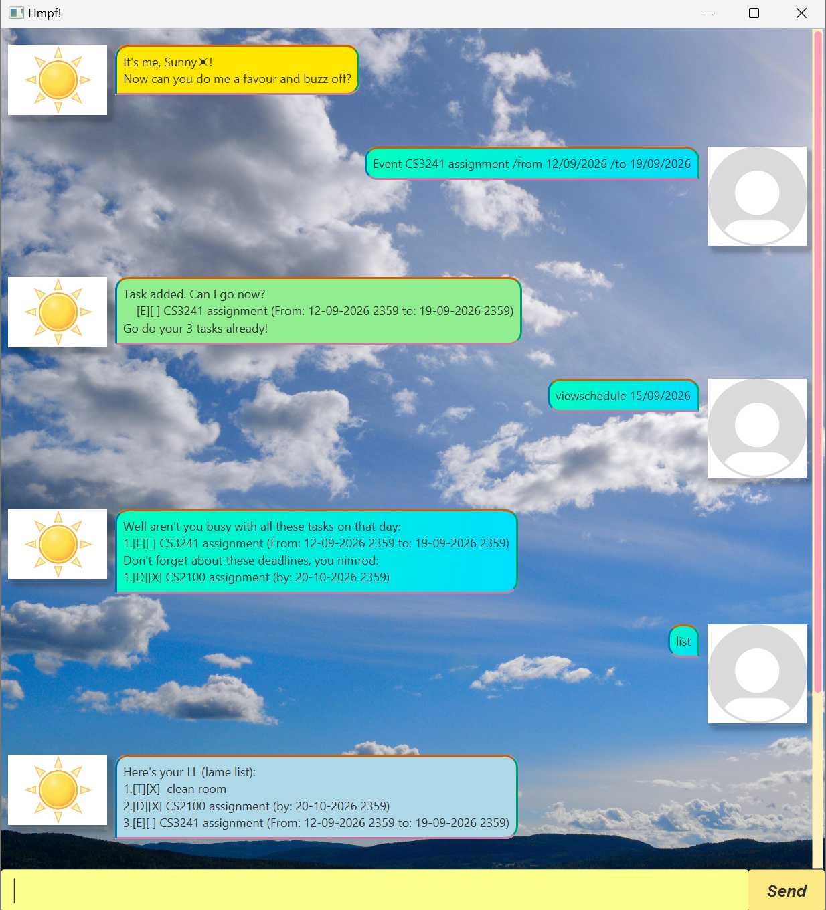
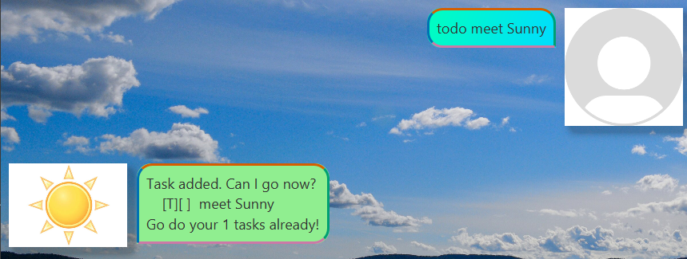
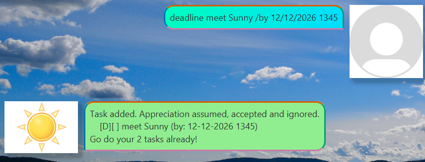
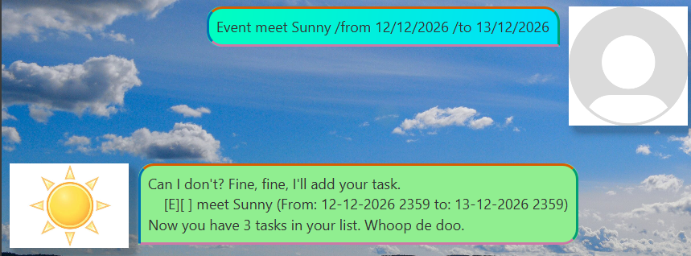
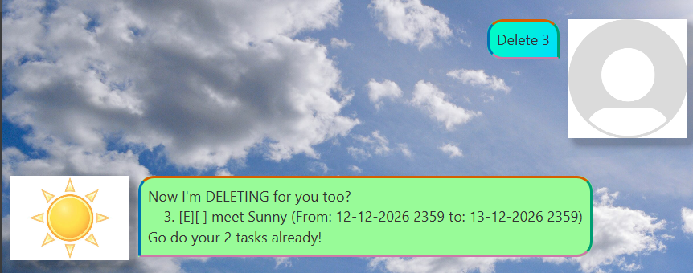
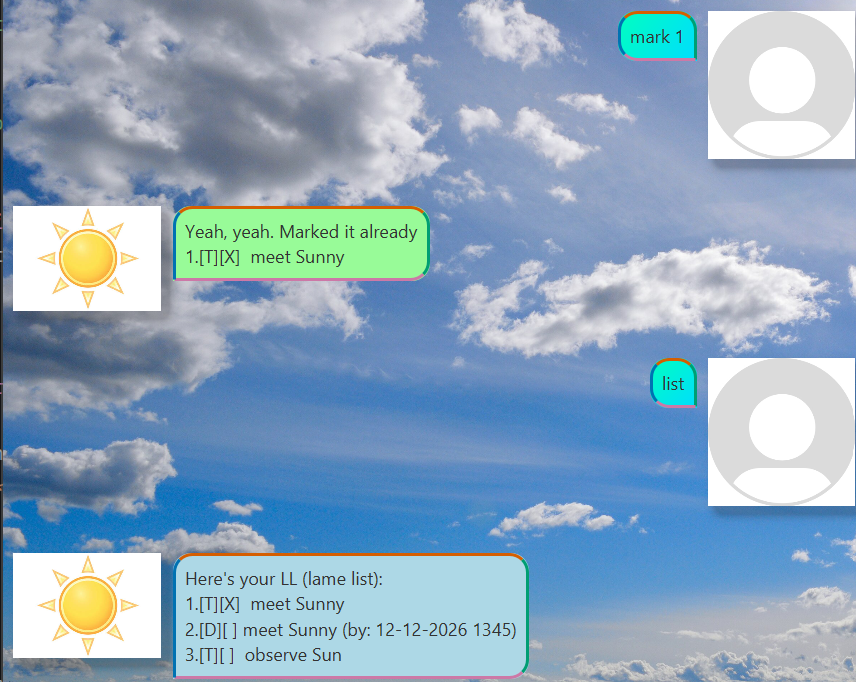
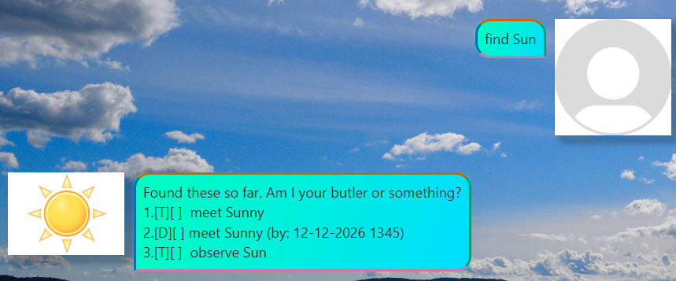
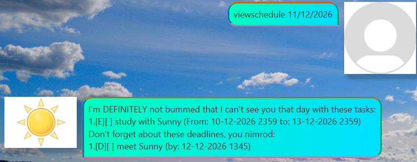

# Sunny User Guide

Sunny is a chatbot that helps save and manage various tasks using a CLI interface. Unlike other chatbots, Sunny seems to
not like you, providing functional utility with interesting interactions.

## Quick start

Ensure you have Java JDK 25 installed and set as your `JAVA_HOME`. You may check this by running 
`java --version` in your terminal.

Download the `.jar` file to a new folder, then in your terminal, run `java -jar sunny.jar`. A window should open with Sunny giving you a snarky greeting.

# Features

## Notes

Responses from Sunny contain a remark, which is drawn from a pool of remarks, hence the examples shown may not be obtained if similar conditions are met due to the randomized output.

If dates can be inputted, they can be of valid formats: "DD/MM/YYYY HHMM", "DD-MM-YYYY HHMM", "DD/MM/YYYY", "DD-MM-YYYY", or invalid formats: "tomorrow", "soon", etc. 

If the code prints dates, if they were valid, it is standardized to the format "DD-MM-YYYY HHMM" with "2359" being the default for "HHMM". Otherwise, it will display what was inputted.

All commands are case-insensitive, meaning "LiSt" and "list" produces the same result.

## Adding ToDos
Adds a "ToDo" task to your taskboard, which contains a description of a task to be completed. 

Format: `todo <description>`

Sunny would then give a witty remark, display the task being added, and inform you of how many tasks the taskboard has.

Example: `todo meet Sunny` saves a ToDo task with the description `meet Sunny`.

## Adding Deadlines
Adds a "Deadline" task to your taskboard, which contains a description of a task to be completed, and a date as the deadline.

Sunny would then give a witty remark, display the task being added, and inform you of how many tasks the taskboard has. 

Format: `deadline <description> /by <date>`

Examples: 
- `deadline meet Sunny /by 12/12/2026` since the date is valid, it is saved as `12-12-2026 2359`.
- `deadline meet Sunny /by 12/12/2026 1345` since the date and time are valid, it is saved as `12-12-2026 1345`.
- `deadline meet Sunny /by Tomorrow` since the date is invalid, it is saved as `Tomorrow`.
- `deadline meet Sunny /by 12/13/2026` since the date is invalid, it is saved as `12/13/2026`.

## Adding Events
Adds an "Event" task to your taskboard, which contains a description of a task to be completed, a date for when the event starts, and a date when the event ends.

Sunny would then give a witty remark, display the task being added, and inform you of how many tasks the taskboard has. 

Format: `event <description> /from <date> /to <date>`

Example: 

- `event meet Sunny /from 12/12/2026 /to 13/12/2026` since both dates are valid, they are saved as `12-12-2026 2359` and `13-12-2026 2359`.
- 

## Listing all tasks (list)
Shows all tasks on the taskboard with any associated dates.

Format: `list`

## Deleting tasks (delete)
Deletes the task at the specified index from the taskboard.
- The index refers to the index number shown in "list". 
- The index must be a **positive integer no larger than the number of tasks on the taskboard**.

Format: `delete <index>`

Sunny would then give a witty remark, display the task being deleted, and inform you of how many tasks the taskboard has. 

Example: `delete 2` removes the 2nd task in the taskboard.

## Mark
Marks the task at the specified index.

Format: `mark <index>`

Example:

## Unmark
Unmarks the task at the specified index.

Format: `unmark <index>`

## Finding tasks by keyword (find)
Finds tasks whose **descriptions** matches the keyword. 
- Only **one** keyword can be used. 
- Keywords are **only for descriptions**, not dates.
- Keywords are **case-sensitive**.
- Full words are **not needed** to match. For instance, `Sun` would match `Sun` and `Sunny`.

Format: `find <keyword>`

Example:

## Viewing a day's schedule (viewschedule)
Displays events if the input date is **between** the event's start and end dates, and displays deadlines if the input date is **before** the deadline.
- The input date, the event dates and the deadline date must **all be valid dates**, otherwise the program won't consider them.

Format: `viewschedule <valid date>`

Example:

## Viewing help (help)
Displays a basic list of the available commands and their intricacies.

Format: `help`

## Exiting the program (bye)
Exits the program.

Format: `bye`

## Saving data
Sunny saves data after every command that requires manipulating tasks.

## Editing data
Sunny saves data in a `.txt` file in the root of the `.jar` file, namely `[JAR FILE PATH]/data/Sunny'sAmazingTaskboard(ForHerBothersomeUser)`. 
You are welcome to edit it, especially to clear all data rather than deleting tasks one by one.

> [!CAUTION]
> Sunny uses very specific formatting for saving and reading data, and if any corruption / invalid data is detected, 
> Sunny will clear the data file and restart with an empty taskboard. Only edit the data file if you are sure of the 
> required formatting, and if possible, back up the file before editing.

## Issues
If the data file is corrupted, such as text being different from what is expected, for safety reasons Sunny will purge the data and
make a new data file. 
If access to the data file is denied, 